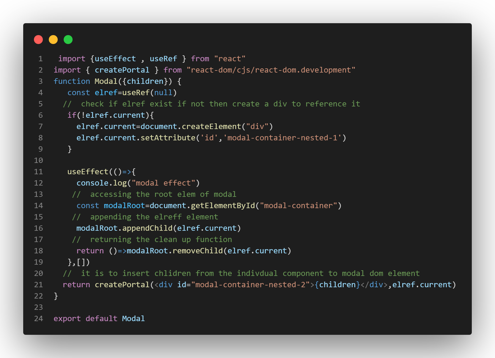
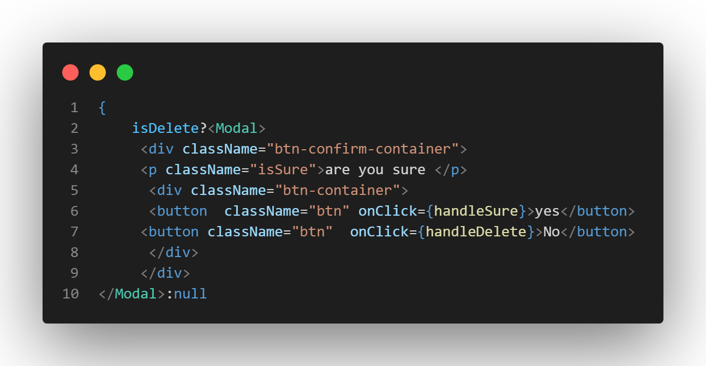

<!-- create portal -->
## what i learnt from  the modal 
- [how-to-create-modal](#how-to-create-modal)

- [using-of-the-modal](#using-of-the-modal)
- [where-and-how-can-we-deploy](#where-and-how-can-we-deploy)
## how to create modal 

## using of the modal
In this image  I have imported the modal component 
and then  whatever you want to pop up it can be put inside as child of modal Component 

## where and how can we deploy 

we can deploy on [vercel]() and [netlify]() and there is many other option but for now i just used these platform 

<i> steps involve in deploying :-</i>

- visit to the website [vercel]() or [netlify]()
- create your accout 
- connect to github 
- import the project you want to deploy 
- And wait for some time as these platform will install packages and deploy automatically 
- Now everything done you are good to go  tada!  

## see the deployment 
[mySplash](https://sparkling-sfogliatella-f35241.netlify.app/)
